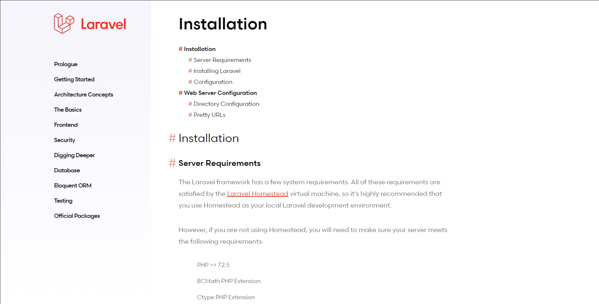

# Laravel Documentation

You can find the online version of the Laravel documentation at [https://laravel.com/docs](https://laravel.com/docs)

## Getting Started
* Download the project (the version you need).
* Run index.html

## Preview

